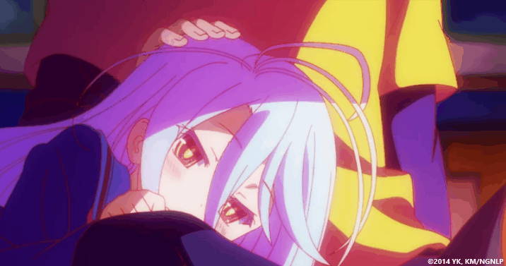

# 👋 About me

* **Name:** Alexey
* **Gender:** ~~Dead Inside~~ Male
* **Hobbies:** Play games and sometime make simple AMV for myself =d
* **Work Experience:**
    - **SantaCraft** (2019 - 2020) - Discord Leader and Developer;
    - **Aurora** (2020) - Owner and Developer;
    - **GREMORY** (2021 - PRESENT) - Administartor and Developer;
* **Projects:**
    - [**VK-Spotify-Integration**](https://github.com/yokkkoso/VK-Spotify-Integration) - Spotify integration to Russian social network VKontakte;
   
# ⌨ My Skills

    
    
    
    
    
    

# 🛠 My Tools

    
    
    
    
    
    
    

# ✉ My contacts

    
    
    

# 📊 My Stats

    
    

# 🥰 Just some cuteness =d

    

